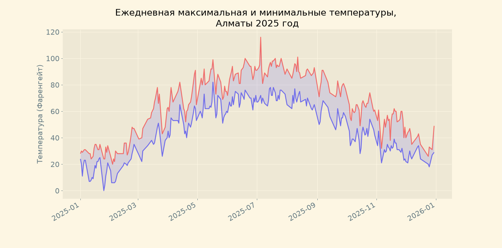
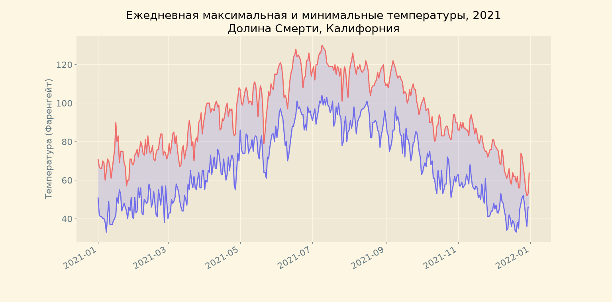
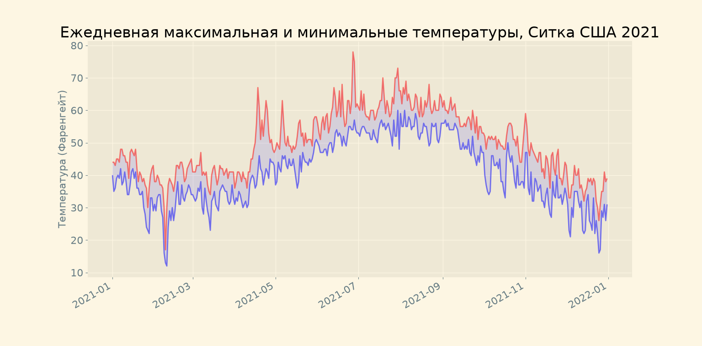

# Погода в разных точках мира
В этом репозитории показана информация о минимальных и максимальных температурах в разных участках мира.  
Я покажу вам, как можно показывать **диаграммы** с помощью кода, сделанного полностью на языке **Python**.  
**Стоит упомянуть, что все данные на диаграмме записаны в Фаренгейтах!**
>Информация о погодных условиях взята с сайта NOAA Climate Data Online!

Вот ссылка на него: [NOAA Climate Data Online](https://www.ncdc.noaa.gov/cdo-web/)

## Алматы, 2025 год
Первым следует конечно упоминуть о второй столице  нашей страны - **Алматы**.  
Вот погодные условия за весь 2025 год:

## Другие примеры (Долина Смерти и Ситка, США)
В качестве примера я также взял данные из разных областей США за 2021 год.  
Вот они:  

